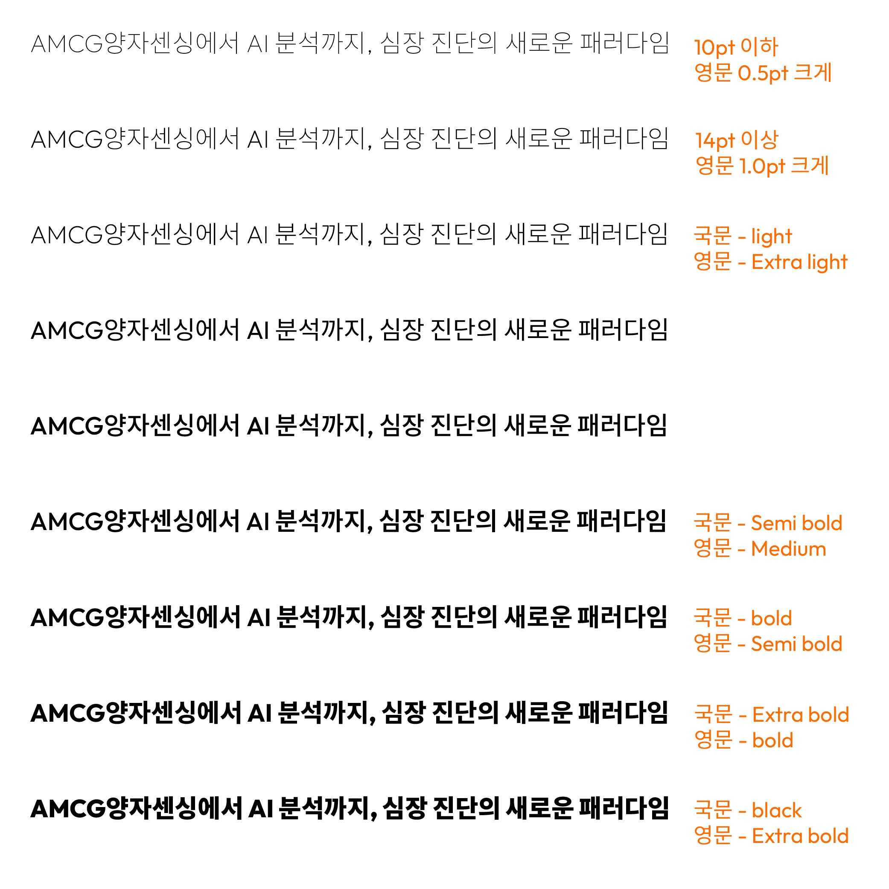

<div align="center">

<picture>
  <source media="(prefers-color-scheme: dark)" srcset="assets/logo/amcg-logo-white.png">
  
</picture>

# AMCG Brand Font

**AMCG 공식 브랜드 서체** · 국문 Noto Sans KR + 영문 Outfit 병합 오픈폰트

[](https://scripts.sil.org/OFL)
[](../../releases/latest)


</div>

---

국문 **Noto Sans KR** 과 영문 **Outfit** 을 하나로 합쳐, 국·영문이 함께 쓰이는 문서와 화면에서 일관된 타이포그래피를 제공하는 AMCG 공식 브랜드 서체입니다. [SIL Open Font License 1.1](https://scripts.sil.org/OFL) 기반의 오픈폰트로 누구나 자유롭게 사용할 수 있습니다.

> A merged Korean (Noto Sans KR) + Latin (Outfit) brand typeface, distributed under the SIL Open Font License 1.1.

## 서체 구성

| Family | 용도 | 특징 |
|--------|------|------|
| **AMCG** | 본문 (국·영문 혼합) | 영문·숫자를 국문보다 약간 크게 조정 |
| **AMCG Display** | 제목·큰 글씨 | 큰 크기에서 영문을 더 강조 |
| **AMCG EN** | 영문 전용 | 영문 본래 크기 |

각 패밀리 **9 weight** — Thin · ExtraLight · Light · Regular · Medium · SemiBold · Bold · ExtraBold · Black

## 다운로드 · 설치

최신 버전은 **[Releases](../../releases/latest)** 에서 받을 수 있습니다.

| 플랫폼 | 파일 |
|--------|------|
| **Windows** | `AMCG-Font-Installer.exe` |
| **macOS** | `AMCG-Font-Installer.pkg` |
| **수동 설치 (TTF)** | `AMCG-Desktop-Fonts.zip` |

설치 후 실행 중인 프로그램(Office 등)은 다시 실행해야 서체 목록에 나타납니다.

## 웹에서 사용

`fonts/web/` 의 woff2 와 `amcg.css` 를 배포한 뒤:

```html
<link rel="stylesheet" href="/assets/amcg.css">
```
```css
body   { font-family: 'AMCG', sans-serif; }         /* 본문 */
h1, h2 { font-family: 'AMCG Display', sans-serif; } /* 제목 */
.latin { font-family: 'AMCG EN', sans-serif; }      /* 영문 전용 */
```

## 타이포그래피 가이드

<div align="center">

</div>

- **크기별 영문 조정** — 혼합 조판 시 영문을 국문보다 크게: 10pt 이하 +0.5pt (`AMCG`), 14pt 이상 +1.0pt (`AMCG Display`)
- **굵기 페어링** — 영문은 국문보다 한 단계 가벼운 굵기로 짝지어 시각적 무게를 맞춤

## 라이선스

**SIL Open Font License 1.1** — Noto Sans KR © Google · Outfit © The Outfit Project.
개인·상업적 용도로 자유롭게 사용·임베드·재배포할 수 있으며, 폰트 파일 자체의 단독 판매는 제한됩니다. 자세한 내용은 [`LICENSE.txt`](LICENSE.txt) 참고.

<div align="center">
<sub>© AMCG · Navy <code>#002160</code> · Orange <code>#FF6C00</code></sub>
</div>
